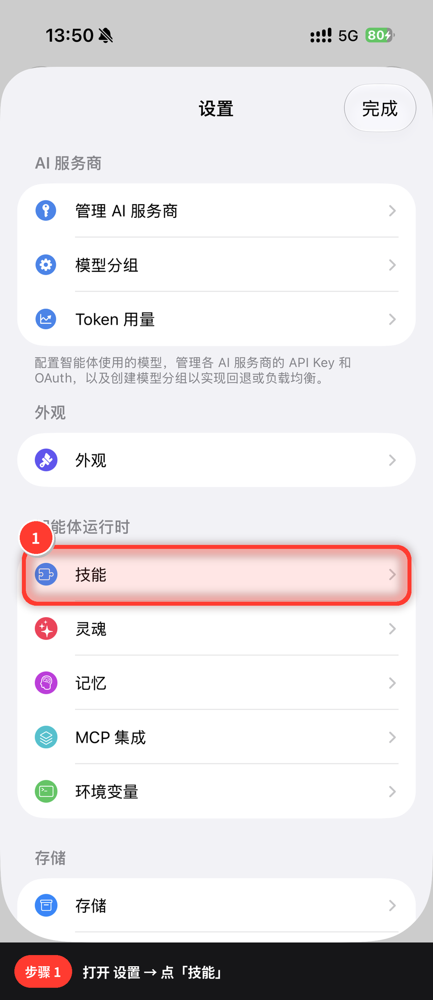
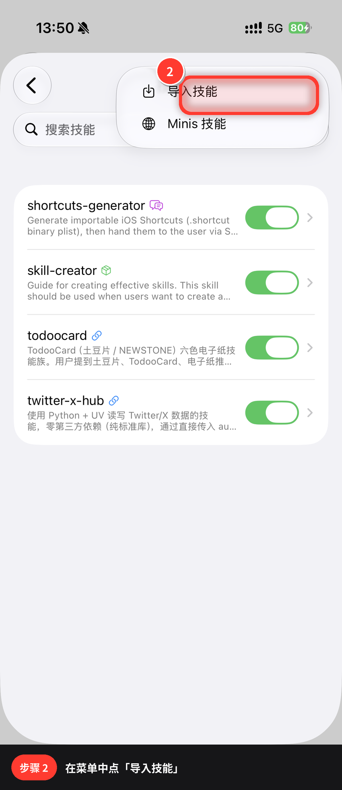
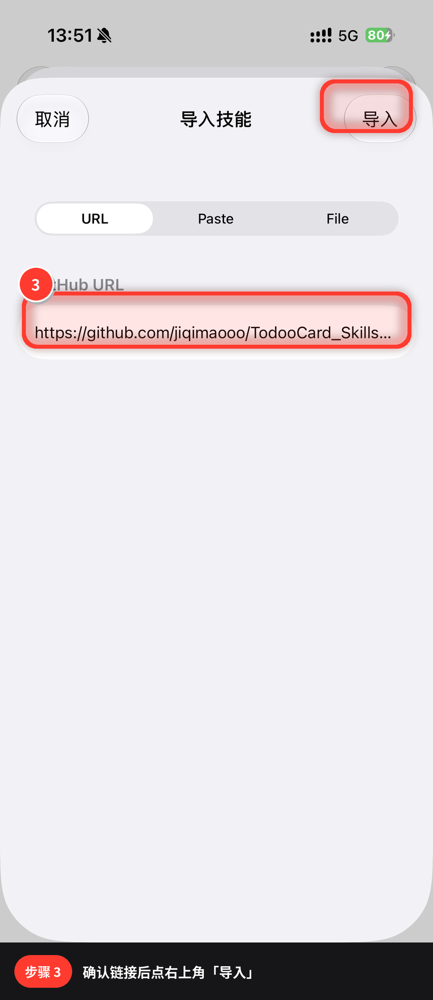

# TodooCard Skills for Minis

[](LICENSE)
[](https://github.com/OpenMinis)
[](https://github.com/jiqimaooo/TodooCard_Skills_Minis)

在 [Minis](https://github.com/OpenMinis) 里把内容推到 **TodooCard / 土豆片** 六色电子纸（528×792）。

当前内置子技能：**今天吃点啥** — 附近随机一家外卖 → 生成卡片 → BLE 整帧推送。

> **非官方**社区项目，与 TodooCard / NEWSTONE / Minis 品牌方无隶属关系。  
> 仓库不含设备 UUID、Token、Cookie 或个人数据。

---

## 目录

- [特性](#特性)
- [安装](#安装)
- [快速开始](#快速开始)
- [项目结构](#项目结构)
- [配置](#配置)
- [扩展子技能](#扩展子技能)
- [传输说明](#传输说明)
- [贡献（PR 提交规范）](#贡献)
- [开源声明](#开源声明)
- [License](#license)

---

## 特性

| | |
|--|--|
| **今天吃点啥** | 定位 + 附近餐饮搜索 → 随机 1 家 → 出卡 → 推屏 |
| **父 / 子技能** | `todoocard` 管设备与传输；场景能力做成子目录，便于扩展 |
| **整帧推送** | 失败即中止，禁止半帧续传（避免花屏） |
| **Minis 一键导入** | 支持从 GitHub URL 安装 |

**导入链接（请指向父技能目录）：**

```text
https://github.com/jiqimaooo/TodooCard_Skills_Minis/tree/main/todoocard
```

---

## 安装

### 方式 A — Minis App（推荐）

1. **设置 → 技能**  
   

2. **右上角菜单 → 导入技能**  
   

3. 选择 **URL**，粘贴上方导入链接，点 **导入**  
   

成功后列表中出现 **todoocard** 并保持开启。

### 方式 B — 命令行

```bash
git clone https://github.com/jiqimaooo/TodooCard_Skills_Minis.git
ln -sfn "$PWD/todoocard" /var/minis/skills/todoocard

apk add py3-pillow font-noto-cjk
mkdir -p /var/minis/shared/todoocard
cp todoocard/config.example.json /var/minis/shared/todoocard/config.json
```

---

## 快速开始

```bash
CLI="python3 /var/minis/skills/todoocard/today-eats/scripts/cli.py"

# 1. 绑定设备（首次）
$CLI scan
$CLI probe --device-id <UUID> --save

# 2. 今天吃点啥
$CLI eat
# 或对话：「今天吃点啥」「中午吃啥，推到土豆片」
```

| 命令 | 说明 |
|------|------|
| `eat` / `今天吃点啥` | 定位 → 随机外卖 → 推屏 |
| `eat --prepare-only` | 只生成卡片，不发送 |
| `scan` / `probe --save` | 扫描 / 探测并写入本地配置 |
| `config --show` | 查看本地配置 |

依赖：Minis 的 `apple-bluetooth`、`apple-location`、`apple-maps`。

---

## 项目结构

```text
TodooCard_Skills_Minis/
├── README.md
├── LICENSE
├── docs/images/                 # 安装示意图
└── todoocard/                   # ← Minis 导入此目录
    ├── SKILL.md                 # 父技能
    ├── config.example.json
    ├── references/protocol.md   # BLE / 六色协议
    ├── scripts/                 # 共享：转换 + 发送
    └── today-eats/              # 子技能：今天吃点啥
        ├── SKILL.md
        └── scripts/
```

| 层级 | 路径 | 职责 |
|------|------|------|
| 父技能 | `todoocard/` | 配置、协议、转换、BLE、路由 |
| 子技能 | `todoocard/today-eats/` | 推荐吃什么 + 出卡 |

推屏与编码只放在父级 `scripts/`，子技能不要复制传输实现。

---

## 配置

| 项 | 说明 |
|----|------|
| 模板 | [`todoocard/config.example.json`](todoocard/config.example.json) |
| 本地路径 | `/var/minis/shared/todoocard/config.json`（**勿提交**） |
| 常用字段 | `device_id`、`screen_orientation`、`block_size`（240）、`transport` |

`screen_orientation` 按实机校准：`normal` 或 `rotate-180-then-flip-horizontal`。

---

## 扩展子技能

1. 新建 `todoocard/<name>/`（kebab-case）+ `SKILL.md`（`name` + `description` = 做什么 & 何时触发）  
2. 脚本放 `todoocard/<name>/scripts/`，需要推屏时引用父级：

```python
PARENT_SCRIPTS = Path(__file__).resolve().parents[2] / "scripts"
sys.path.insert(0, str(PARENT_SCRIPTS))
from image_to_payload import convert
```

3. 更新 [`todoocard/SKILL.md`](todoocard/SKILL.md) 子技能表  
4. 自测：`py_compile`；失败路径不得半帧 resume  

---

## 传输说明

协议细节见 [`todoocard/references/protocol.md`](todoocard/references/protocol.md)。

- 服务 `FEF0`，数据块 payload **240** 字节  
- 六色 SE0368 + QuickLZ stored 帧  
- **整帧发送**；失败整图重来  

**性能（务实预期）：**

| 环境 | 数据段量级 |
|------|------------|
| Minis `apple-bluetooth`（`with_response`） | 约 60–80s / 帧 |
| 原生 CoreBluetooth `withoutResponse`（如 macOS） | 约 20s 量级 |

Minis 内变快取决于宿主是否提供 withoutResponse / 批量写；**不是**把 Mac 编译产物放进仓库就能加速 iPhone。

可选 macOS 原生发送器（源码在仓，二进制不进 Git）：

```bash
./todoocard/scripts/build_native_sender.sh ./todoocard/scripts/native_sender
```

---

## 贡献

欢迎 Issue 与 Pull Request。下面是**本仓库**（`jiqimaooo/TodooCard_Skills_Minis`）的完整提交规范。  
向上游 [OpenMinis/MinisSkills](https://github.com/OpenMinis/MinisSkills) 投稿时，还须遵守[官方 Checklist](https://github.com/OpenMinis/MinisSkills#submission-checklist)，见 [§ 与官方技能库](#与官方技能库-openminisminisskills)。

### 1. 开始之前

1. 先开 Issue 讨论（大改、新子技能、改传输协议时强烈建议）。  
2. 小改动（错别字、注释、文档）可直接 PR。  
3. 确认你的改动符合架构：

| 规则 | 要求 |
|------|------|
| 安装入口 | 只有 `todoocard/`；不要在仓库根再挂第二个可导入 skill |
| 子技能位置 | 一律 `todoocard/<sub-skill>/` |
| 传输层 | 只维护在 `todoocard/scripts/` + `todoocard/references/` |
| 禁止复制 | 子技能内不得再拷贝 `safe_send.py` / `image_to_payload.py` |
| 配置 | 真实设备配置仅本地；仓库只保留 `config.example.json` |

### 2. 分支命名

从最新 `main` 拉分支：

| 类型 | 分支名示例 |
|------|------------|
| 新功能 | `feat/weather-subskill` |
| 修复 | `fix/ble-connect-retry` |
| 文档 | `docs/install-screenshots` |
| 重构 | `refactor/cli-paths` |
| 杂项 | `chore/gitignore` |

```bash
git clone https://github.com/jiqimaooo/TodooCard_Skills_Minis.git
cd TodooCard_Skills_Minis
git checkout main && git pull origin main
git checkout -b feat/your-topic
```

### 3. Commit 规范

采用可读的 **Conventional Commits** 风格（中英文均可，推荐英文动词现在时）：

```text
<type>(<scope>): <summary>

[optional body: why / impact / risk]
```

| type | 用途 |
|------|------|
| `feat` | 新子技能、新用户可见能力 |
| `fix` | 修 bug（花屏、连不上、文案错误等） |
| `docs` | 仅 README / SKILL / protocol / 配图 |
| `refactor` | 行为不变的结构整理 |
| `perf` | 性能（需说明测量方式与是否影响兼容） |
| `chore` | 工具、忽略规则、杂项 |

| scope 示例 | 含义 |
|------------|------|
| `today-eats` | 仅子技能 |
| `transport` / `ble` | 父级发送与转换 |
| `docs` | 文档 |
| `repo` | 仓库级配置 |

**好的例子：**

```text
feat(today-eats): add prepare-only dry-run flag
fix(ble): abort on disconnect without resume
docs: expand PR submission guide
```

**避免：** `update`、`fix stuff`、`临时提交`、一次 commit 塞多个无关主题。

提交前：

```bash
git add -A
git status
# 人工确认：没有 config.json / 密钥 / .bin / .qlz / native_sender 二进制 / __pycache__

# 语法检查（按你改动的路径调整）
python3 -m py_compile todoocard/scripts/*.py todoocard/today-eats/scripts/*.py

git commit -m "feat(today-eats): …"
```

### 4. 可以提交 vs 禁止提交

**可以：**

- `todoocard/**` 源码与 `SKILL.md`
- `config.example.json`（空或占位字段）
- `docs/` 说明与已打码的示意图
- `README.md` / `LICENSE` / `.gitignore`

**禁止（PR 含这些会被要求改掉）：**

```text
**/config.json                 # 真实 device_id 等
**/*token* **/*secret* **/*cookie* **/*.env
**/*.bin **/*.protocol.qlz **/*.log **/*_report.json
**/native_sender               # 预编译二进制（.swift 源码可以）
**/__pycache__/ **/*.pyc
```

以及：API Key、账号 Cookie、个人手机号、可识别个人的轨迹/地址明细、未授权的第三方专有代码。

### 5. 新增子技能（详细）

```text
todoocard/
└── my-skill/                 # kebab-case
    ├── SKILL.md              # 必填
    ├── scripts/              # 可选
    │   └── …
    ├── references/           # 可选
    └── assets/               # 可选
```

**`SKILL.md` 最低要求：**

```yaml
---
name: my-skill
description: >
  做什么。何时触发（写上用户可能说的原话）。
  父技能为 todoocard。
---
```

正文建议包含：何时使用、命令/对话示例、步骤流程、如何调用父级传输、依赖。  
推屏时引用父脚本（路径以子技能 `scripts/foo.py` 为基准）：

```python
from pathlib import Path
import sys

PARENT_SCRIPTS = Path(__file__).resolve().parents[2] / "scripts"
# my-skill/scripts/foo.py → parents[2] == todoocard/
sys.path.insert(0, str(PARENT_SCRIPTS))
from image_to_payload import convert
```

**必须同步改的两处索引：**

1. [`todoocard/SKILL.md`](todoocard/SKILL.md) 的「子技能」表  
2. 本 README 的结构/特性表（若对外可见）

**自测最低集：**

- [ ] `python3 -m py_compile` 通过  
- [ ] 有设备：整帧推送成功；断连后**不会**从中间 resume  
- [ ] 无设备：至少 `prepare-only` / 出图路径可跑  
- [ ] 未引入新的密钥或本机绝对路径（Minis 约定路径除外）

### 6. 修改父级传输层（高风险）

改 `todoocard/scripts/safe_send.py`、`image_to_payload.py`、协议文档时：

- PR 标题/正文标明 **影响所有子技能**
- 说明兼容性：旧配置是否仍可用、orientation / block_size 是否变化  
- 禁止默认开启「半帧续传」「乱序并发写 FEF2」  
- 若改 payload 格式：提供验证方式与回滚说明；未验证前不要当默认路径  
- 建议在正文附上简短实测（块数、耗时、是否花屏）

### 7. Pull Request 要求

**标题：** 与 commit 类似，简洁说明意图。

```text
feat(today-eats): improve card layout spacing
fix(ble): prevent resume after disconnect
docs: detail PR submission guide
```

**正文模板（复制使用）：**

```markdown
## Summary
- 做了什么（1–3 条）
- 为什么（动机 / 用户问题）

## Type
- [ ] feat  - [ ] fix  - [ ] docs  - [ ] refactor  - [ ] perf  - [ ] chore

## Scope
- [ ] 仅文档
- [ ] 仅子技能：`today-eats` / `________`
- [ ] 父技能传输层（scripts / protocol）
- [ ] 仓库级（README / CI / gitignore）

## Changes
- 关键文件或行为变化（可贴目录树）

## Test plan
- [ ] `python3 -m py_compile …`
- [ ] `cli.py eat --prepare-only` 或等价路径
- [ ] （有设备）整帧推送；断开不 resume
- [ ] 未包含 config.json / 密钥 / bin / qlz

## Checklist
- [ ] 符合父/子架构，未复制传输层
- [ ] 新增子技能已更新父 SKILL 索引
- [ ] 无隐私与凭证
- [ ] 未提交预编译 native_sender
- [ ] （若改协议）已更新 `references/protocol.md`
```

**体积与历史：**

- 不要把大图、视频、多次试验二进制打进 Git  
- 配图放 `docs/images/`，注意压缩与打码  
- 一个 PR 聚焦一个主题；大重构与行为修复拆开

**Review 合并预期：**

- 维护者会检查：架构、密钥、半帧风险、是否破坏导入路径  
- 可能要求：补测试说明、改描述、拆 PR  
- 合并后默认进 `main`；未声明的 breaking change 应在 Summary 置顶

### 8. 完整提交前 Checklist

**架构**

- [ ] 只通过 `todoocard/` 作为可安装根  
- [ ] 子技能在 `todoocard/<name>/` 且含 `SKILL.md`  
- [ ] 传输代码仍在父级 `scripts/`  

**安全 / 隐私**

- [ ] 无真实 `config.json` / device_id  
- [ ] 无 token、cookie、env 密钥  
- [ ] 无 `.bin` / `.qlz` / 日志 / 预编译二进制  

**质量**

- [ ] commit message 符合 type(scope)  
- [ ] `py_compile` 通过  
- [ ] 推屏逻辑保持整帧、失败中止  
- [ ] 文档与索引已更新（若需要）  

**PR**

- [ ] 标题清晰  
- [ ] 正文含 Summary / Test plan / Checklist  
- [ ] 与 `main` 无无关大段格式化 diff  

### 9. 与官方技能库 OpenMinis/MinisSkills

| | 本仓库 | [OpenMinis/MinisSkills](https://github.com/OpenMinis/MinisSkills) |
|--|--------|--------|
| 形态 | 父+子，便于产品扩展 | **一技能一顶层目录**（flat） |
| 导入 | `…/tree/main/todoocard` | 合并后出现在官方列表 |
| 规范 | **本节全文** | 官方 README 的 Submission Checklist |
| License | MIT | 仓库为 Apache-2.0，贡献需可兼容 |

**上游 PR 额外注意：**

1. Fork 官方仓，从 `upstream/main` 开分支。  
2. **只新增**一个顶层目录（推荐直接放可安装的 `todoocard/` 包）。  
3. 满足官方：kebab-case、`name` + `description`（what + when）、正文宜 &lt; 500 行、scripts/references/assets、无密钥、可选 evals。  
4. 不要把本仓库根 README 整本塞进官方仓；不要改他人技能。  
5. 官方模型是 flat 安装：嵌套「第二个可注册 SKILL」可能不被工具识别——上游包应保证 **导入 `todoocard/` 即可用**。  
6. PR 仍建议带：Summary、Layout 树、Checklist、Test plan。  

本仓库可以更「产品化」；**官方仓以可合并、可单目录安装为第一约束**。

---


## 开源声明

**许可证：** [MIT](LICENSE)  
Copyright (c) 2026 TodooCard Skill Contributors  

允许使用、修改、再分发与商用；再分发须保留版权与许可声明。软件按「现状」提供，不作担保。

**开源范围：** 技能说明、脚本源码、协议文档、示例配置、安装图。  
**不包含：** 真实设备配置、密钥、运行产物、预编译 `native_sender`。

**致谢：** [Minis](https://github.com/OpenMinis) / [MinisSkills](https://github.com/OpenMinis/MinisSkills)（Apache-2.0）；[TodooCard_Skills](https://github.com/Sunbelife/TodooCard_Skills)（传输思路参考）；Pillow 等依赖遵循其各自许可证。

**商标：** TodooCard、土豆片、NEWSTONE、Minis 等归各自权利人；本项目为非官方社区技能，不代表官方背书。

**使用：** 仅在你拥有或已获授权的设备上推送；贡献即表示你有权以 MIT 提交且未夹带专有代码或密钥。

---

## License

[MIT](LICENSE) © 2026 TodooCard Skill Contributors
